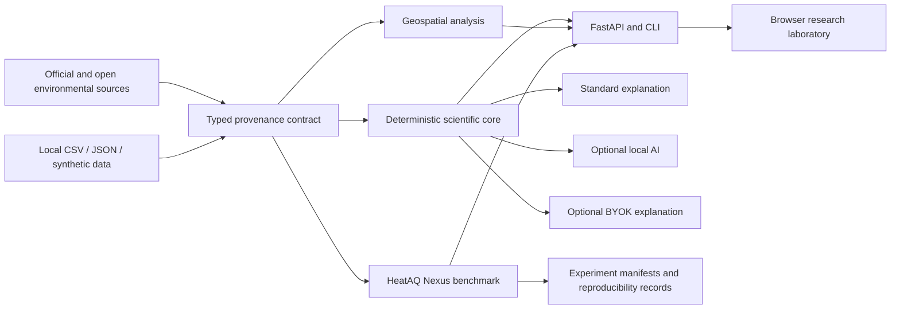

# HeatSafe Climate & Air Quality Intelligence Lab

[](https://www.python.org/)
[](LICENSE)
[](ROADMAP.md)
[](AI_ACCESS_MODES.md)

**Reproducible environmental intelligence for extreme heat, air quality, wildfire smoke, urban climate and indoor resilience.**

HeatSafe is an independent research-software platform created and maintained by **Faramarz Kowsari**. It combines deterministic scientific methods, open-data connectors, uncertainty-aware forecasting, geospatial analysis, privacy-preserving browser tools and optional AI explanation layers.

> HeatSafe is an educational and research decision-support system. It is not an official warning service, medical device, building-certification tool or emergency-response system.

## Scientific mission

HeatSafe studies how multiple environmental hazards interact across scales:

- regional warming, heatwaves and hot nights;
- PM2.5, smoke and air-quality episodes;
- urban heat islands and land-surface temperature;
- indoor heat retention, ventilation and cooling demand;
- compound heat–air-quality risk;
- forecast uncertainty, domain shift and model reliability.

The project is designed as a **flagship research portfolio** in environmental AI, scientific Python, data engineering, MLOps, geospatial analytics and research software engineering.

## Capability tiers

### Tier 0 — Standard, no AI API required

The complete deterministic core remains available without a paid AI service:

- climate trend analysis;
- heatwave detection;
- air-quality summaries;
- wildfire context analysis;
- urban-heat analysis;
- ventilation decisions;
- home heat profiling;
- cooling-energy estimation;
- local CSV/JSON workflows;
- CPU forecasting baselines;
- conformal prediction intervals;
- experiment manifests and checksums.

### Tier 1 — Local AI

A local model such as Ollama may explain already-computed results. The language model is never allowed to replace the deterministic decision, modify measurements or silently invent evidence.

### Tier 2 — BYOK and advanced providers

Researchers may connect an OpenAI-compatible provider or credentialed environmental-data service using their own server-side secrets. These integrations are optional and never required for the standard workflow.

See [AI Access Modes](AI_ACCESS_MODES.md).

## Research architecture



## Implemented research domains

- **Climate trends:** OLS, Theil–Sen, Kendall trend, bootstrap slope intervals, anomalies, hot-day and hot-night counts, cooling degree days and a documented change-point screen.
- **Heatwaves:** absolute, percentile and compound temperature–humidity event definitions.
- **Air quality:** concentration-first analysis with explicitly named optional AQI standards.
- **Urban heat:** land-surface-temperature workflows that do not mislabel LST as near-surface air temperature.
- **Wildfire context:** proximity and wind-plausibility analysis without unsupported causal attribution.
- **HeatAQ Nexus:** chronological forecasting benchmarks with persistence, seasonal naive, moving average, linear regression, random forest and gradient boosting.
- **Uncertainty:** split-conformal prediction intervals and coverage reporting.
- **Compound risk:** a transparent exploratory multi-hazard score with exposed weights and sensitivity analysis.
- **Provenance:** checksums, code revision, runtime environment, seeds, configurations and input/output artifacts.
- **AI explanation:** deterministic, local and BYOK modes with numeric-grounding checks.

## Quick start

```bash
python -m venv .venv
source .venv/bin/activate  # Windows: .venv\Scripts\activate
python -m pip install --upgrade pip
pip install -e ".[dev]"
python scripts/generate_demo_data.py
python -m heatsafe serve
```

Open `http://127.0.0.1:8000`. Interactive API documentation is available at `http://127.0.0.1:8000/docs`.

## Command-line examples

```bash
python -m heatsafe ventilation --indoor 29 --outdoor 24 --pm25 12 --humidity 55 --wind 9 --cross-ventilation
python -m heatsafe cooling --power 1200 --duty 0.6 --hours 8 --days 30 --price 0.18 --currency USD
python -m heatsafe benchmark data/synthetic/hourly_environment.csv --column pm25_ug_m3
python -m heatsafe compound-risk --heat 0.92 --pm25 0.64 --humidity 0.71 --night-heat 0.83 --smoke 0.25
python -m heatsafe manifest --experiment-id pm25-baseline-001 --input data/synthetic/hourly_environment.csv --output artifacts/manifest.json --seed 42
```

## Reproducible research standard

Every publishable experiment should record:

- exact input artifacts and SHA-256 checksums;
- code commit or release;
- configuration and random seed;
- runtime and dependency versions;
- chronological or spatial split protocol;
- baseline comparisons;
- uncertainty and calibration;
- subgroup and domain-shift results;
- output artifacts and limitations.

Read [Experiment Protocol](EXPERIMENT_PROTOCOL.md), [Methodology](METHODOLOGY.md), [Reproducibility](REPRODUCIBILITY.md), model cards, data cards and [Limitations](LIMITATIONS.md).

## Repository map

- `src/heatsafe/core/` — deterministic scientific and household logic
- `src/heatsafe/connectors/` — source adapters and normalized data contracts
- `src/heatsafe/research/` — benchmarks, compound-risk analysis and experiment provenance
- `src/heatsafe/api/` — typed FastAPI endpoints
- `apps/web/` — browser research laboratory
- `benchmarks/heataq-nexus/` — benchmark configurations, split protocols and results
- `data/` — synthetic/sample data, catalog and data cards
- `docs/` — architecture, methods, regional workflows, security and public research site
- `tests/` — unit, API, connector, contract, edge-case and regression tests

## Quality gate

```bash
python scripts/check_scientific_identity.py
ruff check src tests scripts
mypy src/heatsafe/core/models.py src/heatsafe/core/ventilation.py src/heatsafe/core/home_profile.py src/heatsafe/core/cooling.py src/heatsafe/core/indoor_air.py src/heatsafe/ai.py src/heatsafe/research/compound_risk.py src/heatsafe/research/provenance.py
pytest --cov=heatsafe --cov-report=term-missing
npx tsc --project apps/web/tsconfig.json
python scripts/check_links.py
python scripts/check_secrets.py
```

Docker build, CodeQL and GitHub Pages deployment are enforced through GitHub Actions.

## Research outputs

The target outputs are:

1. versioned research-software releases;
2. citable benchmark datasets;
3. reproducible experiment bundles;
4. technical reports and preprints;
5. a software paper after the platform is feature-complete and independently reviewed.

A DOI should be minted only for a reviewed, tagged scientific release.

## Citation

GitHub exposes **Cite this repository** from [`CITATION.cff`](CITATION.cff). Release metadata is also available in `.zenodo.json` and `codemeta.json`.

## About the Maintainer

<p align="center">
  <a href="https://github.com/FaramarzKowsari">
    
  </a>
</p>

### Faramarz Kowsari

**Author · Software Engineer · AI Researcher**

Faramarz Kowsari is an author, Software Engineer and AI researcher based in Istanbul. Focusing on the intersection of technology, education, and personal growth, he has published over 80 digital titles on international platforms. His areas of expertise span Artificial Intelligence, prompt engineering, modern trading strategies (Smart Money Concepts & algorithmic trading), as well as classical literature and mindfulness. In addition to writing, he develops web-based educational tools and creates specialized instructional video content.

### Official Profiles & Repositories

- **ORCID:** https://orcid.org/0000-0003-1692-0453
- **Google Scholar:** https://scholar.google.com/citations?user=G7tP5WMAAAAJ&hl=en
- **GitHub:** https://github.com/FaramarzKowsari
- **LinkedIn:** https://www.linkedin.com/in/faramarzkowsari
- **Google Books:** https://play.google.com/store/search?q=Faramarz_Kowsari&c=books
- **Official Website:** https://faramarzkowsari.github.io/
- **Zenodo Records:** https://zenodo.org/search?q=creators.orcid%3A%220000-0003-1692-0453%22&l=list&p=1&s=10&sort=bestmatch

A standalone canonical profile is also available in [AUTHOR.md](AUTHOR.md).

## License and governance

Software: Apache-2.0. Original documentation and diagrams: CC BY 4.0. Synthetic demonstration data: CC0-1.0. External data remains subject to provider-specific terms.

See [Contributing](CONTRIBUTING.md), [Governance](GOVERNANCE.md), [Security](SECURITY.md), [Privacy](PRIVACY.md), [Responsible Use](RESPONSIBLE_USE.md) and [Roadmap](ROADMAP.md).

## Production-grade data foundation

HeatSafe includes typed environmental source descriptors, resilient retrieval,
rate limiting, disk caching, data-quality reports, verifiable dataset snapshots
and official-source foundations for NOAA CDO, US EPA AQS, NASA FIRMS and local
EEA Parquet. ERA5-Land has an explicit request specification, while Türkiye
sources remain registry-only until machine access and redistribution conditions
are verified.

See [DATA_FOUNDATION.md](DATA_FOUNDATION.md).

## HeatAQ Nexus benchmark

HeatAQ Nexus is a CPU-first, no-paid-AI environmental forecasting benchmark with
historical feature engineering, chronological train/calibration/test splits,
rolling-origin evaluation, competitive statistical and tree baselines,
split-conformal uncertainty, event metrics, model cards, a deterministic
leaderboard and experiment manifests.

See [HEATAQ_NEXUS.md](HEATAQ_NEXUS.md).

## Multi-city external validation

HeatSafe includes a no-paid-AI geographic robustness laboratory with
leave-one-city-out and leave-one-region-out evaluation, domain-shift
diagnostics, moving-block bootstrap confidence intervals, horizon-aware
Diebold–Mariano comparisons, seasonal and event-intensity slices, conformal
coverage analysis, and a worst-domain robustness leaderboard.

See [EXTERNAL_VALIDATION.md](EXTERNAL_VALIDATION.md).

## Official benchmark registry

HeatSafe includes an immutable official-source snapshot registry with dataset cards,
SHA-256 verification, deterministic registry indices and DOI-ready benchmark release
bundles. See [OFFICIAL_BENCHMARK_REGISTRY.md](OFFICIAL_BENCHMARK_REGISTRY.md).

## Official snapshot pipeline

HeatSafe includes a no-paid-AI pipeline for secret-free official-source
acquisition plans, deterministic quality gates, immutable snapshots,
benchmark-ready tables, automated Dataset Cards and registry releases.

See [OFFICIAL_SNAPSHOT_PIPELINE.md](OFFICIAL_SNAPSHOT_PIPELINE.md).

<!-- HEATSAFE_EXPERIMENT_ORCHESTRATOR_README_V1 -->
## Reproducible experiment orchestrator

HeatSafe includes a CPU-first experiment orchestrator that turns a synthetic,
CSV or frozen-snapshot input into a self-contained paper-ready result bundle.
Each run preserves the canonical input, immutable JSON configuration, complete
model metrics, uncertainty diagnostics, SVG figures, Markdown and HTML reports,
provenance manifests, reproduction commands, SHA-256 verification and candidate
release metadata.

```bash
heatsafe-experiment template --output experiment.json

heatsafe-experiment run   --spec examples/experiments/heataq-nexus-synthetic.json   --output artifacts/experiments/heataq-nexus-synthetic   --repository-root .

heatsafe-experiment verify artifacts/experiments/heataq-nexus-synthetic
```

No paid AI API is required. Candidate metadata does not mint or claim a DOI.
See [EXPERIMENT_ORCHESTRATOR.md](EXPERIMENT_ORCHESTRATOR.md).
