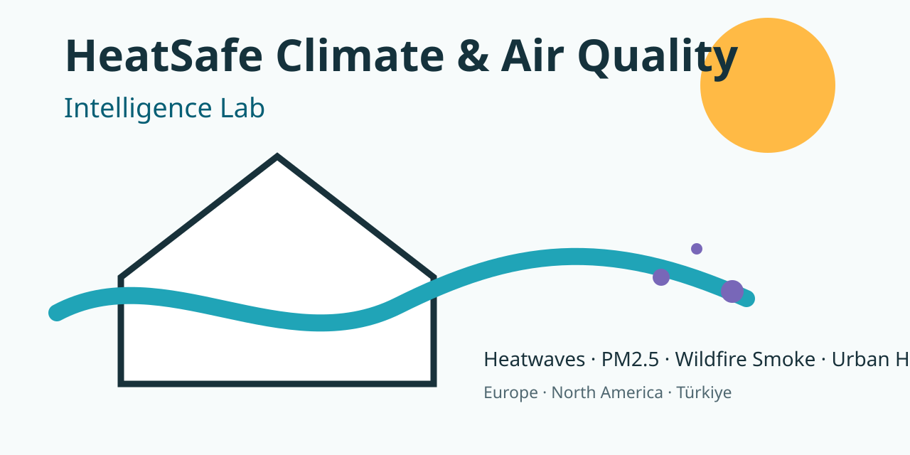
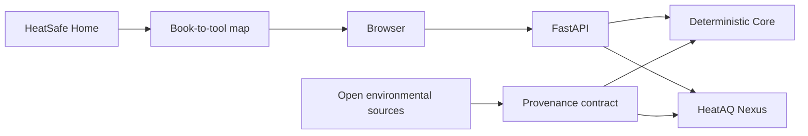

# HeatSafe Climate & Air Quality Intelligence Lab

[](https://www.python.org/)
[](LICENSE)
[](CHANGELOG.md)

**Open-Data AI for Heatwaves, Air Quality, Wildfire Smoke, Urban Heat and Home Resilience across Europe, North America and Türkiye**

HeatSafe is a reproducible research and household decision-support platform by **Faramarz Kowsari**. It links a practical browser laboratory, a regional climate and air-quality atlas scaffold, and the **HeatAQ Nexus** forecasting benchmark. It is the software companion to *HeatSafe Home*.

> This project is an educational and research decision-support system. It is not an official weather-warning service, medical device, building-certification tool, or emergency-response system.



## What works in v0.1.0

- Explainable **Home Heat Profile** without a fake certified score
- Deterministic **heat-versus-air-quality ventilation decision**
- **24–72 hour ventilation planner**
- **Cooling energy and cost estimator** with low/central/high assumptions
- **Indoor–Outdoor Comparator** and local-first **Seven-Day Home Heat Log**
- Climate trends: OLS, Theil–Sen, Kendall trend, bootstrap interval, anomalies, hot days/nights, CDD, change-point screen
- Configurable heatwave detection
- Air-quality summary and explicitly labeled US EPA PM2.5/PM10 AQI example
- Urban heat analysis that keeps land-surface and air temperature distinct
- Wildfire proximity and transport-plausibility context without causal overclaiming
- HeatAQ Nexus CPU baselines and conformal prediction intervals
- FastAPI/OpenAPI API, CLI, TypeScript browser app, Docker configuration, synthetic offline data, tests, governance, citation, privacy, and security documentation

Advanced official-source adapters are separated into implemented live connectors and documented specifications; see [Limitations](LIMITATIONS.md).

## Architecture



## Quick start

```bash
python -m venv .venv
source .venv/bin/activate  # Windows: .venv\Scripts\activate
python -m pip install --upgrade pip
pip install -e ".[dev]"
python scripts/generate_demo_data.py
python -m heatsafe serve
```

Open `http://127.0.0.1:8000`; interactive API documentation is at `http://127.0.0.1:8000/docs`.

### One-command examples

```bash
python -m heatsafe ventilation --indoor 29 --outdoor 24 --pm25 12 --humidity 55 --wind 9 --cross-ventilation
python -m heatsafe cooling --power 1200 --duty 0.6 --hours 8 --days 30 --price 0.18 --currency USD
python -m heatsafe benchmark data/synthetic/hourly_environment.csv --column pm25_ug_m3
```

## Docker

```bash
docker compose up --build
```

The container runs non-root and declares a read-only runtime in Compose.

## Data policy

Every normalized record carries provenance and one explicit type: observed, satellite-derived, reanalysis, modeled, forecast, user-entered, estimated, or synthetic. The repository does not relicense third-party data. See [Data Sources](DATA_SOURCES.md), [Licenses](DATA_LICENSES.md), and the machine-readable [catalog](data/catalog.yml).

## Scientific methods

Read [METHODOLOGY.md](METHODOLOGY.md), [REPRODUCIBILITY.md](REPRODUCIBILITY.md), model cards, data cards, and [LIMITATIONS.md](LIMITATIONS.md). The synthetic benchmark is an executable smoke test, not a claim about a real region.

## Book companion

The complete supplied 100-prompt reference was indexed and mapped to software functions in [the book-module map](docs/book-companion/book-module-map.md). The Google Books URL and book DOI are not invented; add them after verification in the companion publication page.

## Repository map

- `src/heatsafe/core/` — deterministic scientific logic
- `src/heatsafe/connectors/` — source adapters and specifications
- `src/heatsafe/research/` — benchmark models, metrics and uncertainty
- `apps/web/` — static TypeScript browser laboratory
- `benchmarks/heataq-nexus/` — configurations, split protocols and results
- `data/` — synthetic/sample data, catalog and cards
- `docs/` — methods, regional workflows, book mapping, security and SEO site
- `tests/` — unit, API, connector, contract, edge-case and regression tests

## Quality gate

```bash
pytest --cov=heatsafe --cov-report=term-missing
ruff check src tests scripts
mypy src/heatsafe
npx tsc --project apps/web/tsconfig.json
python scripts/check_links.py
python scripts/check_secrets.py
```

A Docker build is also enforced in GitHub Actions.

## Citation

GitHub will expose **Cite this repository** from [`CITATION.cff`](CITATION.cff). A Zenodo DOI should be minted only after the GitHub repository is published and a reviewed release is tagged.

## License and governance

Software: Apache-2.0. Original documentation/diagrams: CC BY 4.0. Synthetic demonstration data: CC0-1.0. External data: source-specific terms. See [CONTRIBUTING.md](CONTRIBUTING.md), [GOVERNANCE.md](GOVERNANCE.md), [SECURITY.md](SECURITY.md), and [PRIVACY.md](PRIVACY.md).

## Roadmap

See [ROADMAP.md](ROADMAP.md). The current label is **v0.1.0 — Research Preview**, not a stable v1.0 release.
