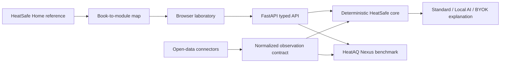

# Architecture

A modular monolith keeps scientific logic testable and avoids premature service boundaries. Data connectors normalize provenance before analysis. The static browser is intentionally dependency-light and is served by FastAPI.
