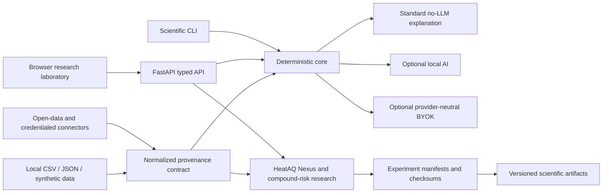

# Architecture

A modular monolith keeps scientific logic testable and avoids premature service boundaries. Data connectors normalize provenance before analysis. The scientific core does not depend on a language model or a paid provider. Optional AI layers explain existing results and remain subordinate to deterministic outputs.
